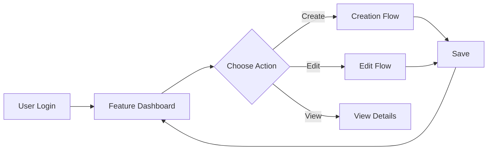

# [Feature Name]

## Overview

[Comprehensive description of what this feature does, its purpose, and value to users]

### Key Capabilities
- [Capability 1]
- [Capability 2]
- [Capability 3]

### User Benefits
- [Benefit 1]
- [Benefit 2]
- [Benefit 3]

## Technical Implementation

### Architecture Overview

```
┌─────────────────┐     ┌─────────────────┐     ┌─────────────────┐
│   User Input    │────▶│  Feature Logic  │────▶│    Output       │
└─────────────────┘     └─────────────────┘     └─────────────────┘
         │                       │                        │
         ▼                       ▼                        ▼
┌─────────────────┐     ┌─────────────────┐     ┌─────────────────┐
│   Validation    │     │   Processing    │     │   Storage       │
└─────────────────┘     └─────────────────┘     └─────────────────┘
```

### Core Components

#### 1. [Component Name]
**Location**: `src/features/[feature]/[component].js`
**Purpose**: [What this component does]
**Key Methods**:
- `methodName()`: [What it does]
- `anotherMethod()`: [What it does]

#### 2. [Component Name]
**Location**: `src/features/[feature]/[component].js`
**Purpose**: [What this component does]
**Dependencies**: [What it depends on]

### Data Model

#### Database Schema
```sql
-- Table: [table_name]
CREATE TABLE feature_data (
    id UUID PRIMARY KEY DEFAULT gen_random_uuid(),
    user_id UUID REFERENCES users(id),
    data JSONB NOT NULL,
    status VARCHAR(50) DEFAULT 'active',
    created_at TIMESTAMP DEFAULT NOW(),
    updated_at TIMESTAMP DEFAULT NOW()
);

-- Indexes
CREATE INDEX idx_feature_user ON feature_data(user_id);
CREATE INDEX idx_feature_status ON feature_data(status);
```

#### Data Flow
1. User initiates action
2. Request validated
3. Business logic processing
4. Data persistence
5. Response generation
6. UI update

### API Endpoints

#### REST API
```http
# Get feature data
GET /api/v1/[feature]
Authorization: Bearer [token]

Response 200:
{
    "data": [...],
    "pagination": {...}
}

# Create new item
POST /api/v1/[feature]
Content-Type: application/json
Authorization: Bearer [token]

Body:
{
    "field1": "value",
    "field2": "value"
}

Response 201:
{
    "id": "uuid",
    "created": true
}

# Update item
PUT /api/v1/[feature]/:id
Content-Type: application/json
Authorization: Bearer [token]

# Delete item
DELETE /api/v1/[feature]/:id
Authorization: Bearer [token]
```

#### GraphQL (if applicable)
```graphql
type Feature {
    id: ID!
    data: JSON!
    status: String!
    createdAt: DateTime!
}

type Query {
    features(filter: FeatureFilter): [Feature!]!
    feature(id: ID!): Feature
}

type Mutation {
    createFeature(input: FeatureInput!): Feature!
    updateFeature(id: ID!, input: FeatureInput!): Feature!
    deleteFeature(id: ID!): Boolean!
}
```

## User Interface

### UI Components

#### Main Interface
**Location**: `src/components/[feature]/[FeatureMain].jsx`
**Description**: [What users see and interact with]

```jsx
// Component structure example
<FeatureContainer>
    <FeatureHeader />
    <FeatureContent>
        <FeatureList />
        <FeatureDetails />
    </FeatureContent>
    <FeatureActions />
</FeatureContainer>
```

#### Key Interactions
1. **[Interaction 1]**: [How it works]
2. **[Interaction 2]**: [How it works]
3. **[Interaction 3]**: [How it works]

### User Flow



1. **Entry Point**: [How users access the feature]
2. **Main Actions**: [Primary user actions]
3. **Success States**: [What success looks like]
4. **Error Handling**: [How errors are communicated]

## Configuration

### Environment Variables
```bash
# Feature-specific configuration
FEATURE_ENABLED=true
FEATURE_RATE_LIMIT=100
FEATURE_TIMEOUT=30000
FEATURE_API_KEY=your-api-key
```

### Application Settings
```javascript
const featureConfig = {
    enabled: process.env.FEATURE_ENABLED === 'true',
    limits: {
        rateLimit: parseInt(process.env.FEATURE_RATE_LIMIT),
        timeout: parseInt(process.env.FEATURE_TIMEOUT)
    },
    options: {
        autoSave: true,
        notifications: true,
        advanced: false
    }
};
```

### Feature Flags
```javascript
// Feature flag configuration
{
    "feature-name": {
        "enabled": true,
        "rolloutPercentage": 100,
        "userGroups": ["beta", "premium"],
        "startDate": "2024-01-01",
        "endDate": null
    }
}
```

## Security Considerations

### Authentication & Authorization
- **Authentication**: [Method used - JWT/Session/OAuth]
- **Required Permissions**: [List of permissions]
- **Role-Based Access**:
  - Admin: [What they can do]
  - User: [What they can do]
  - Guest: [What they can do]

### Data Protection
- **Encryption**: [At rest/in transit details]
- **PII Handling**: [How personal data is handled]
- **Audit Logging**: [What's logged and where]

### Input Validation
```javascript
// Validation schema example
const validationSchema = {
    field1: {
        type: 'string',
        required: true,
        maxLength: 255,
        pattern: /^[a-zA-Z0-9]+$/
    },
    field2: {
        type: 'number',
        min: 0,
        max: 100
    }
};
```

### Security Headers
```javascript
// Required security headers
{
    "Content-Security-Policy": "default-src 'self'",
    "X-Frame-Options": "DENY",
    "X-Content-Type-Options": "nosniff"
}
```

## Performance Optimization

### Caching Strategy
- **Client-side**: [Browser caching approach]
- **Server-side**: [Redis/Memory caching]
- **CDN**: [Static asset caching]

### Database Optimization
- Indexes on frequently queried fields
- Pagination for large datasets
- Query optimization techniques used

### Load Handling
- **Rate Limiting**: [Requests per minute]
- **Concurrent Users**: [Expected capacity]
- **Response Times**: [Target metrics]

## Testing

### Unit Tests
**Location**: `tests/unit/[feature]/`
**Coverage Target**: [X]%

```javascript
describe('Feature Component', () => {
    it('should initialize correctly', () => {
        // Test implementation
    });
    
    it('should handle user input', () => {
        // Test implementation
    });
});
```

### Integration Tests
**Location**: `tests/integration/[feature]/`

```javascript
describe('Feature API Integration', () => {
    it('should create new item via API', async () => {
        // Test implementation
    });
});
```

### E2E Tests
**Location**: `tests/e2e/[feature]/`

```javascript
describe('Feature User Flow', () => {
    it('should complete full user journey', () => {
        // Cypress/Playwright test
    });
});
```

## Monitoring & Analytics

### Key Metrics
- **Usage**: [Daily/Monthly active users]
- **Performance**: [Response times, error rates]
- **Business**: [Conversion, engagement metrics]

### Logging
```javascript
// Logging strategy
logger.info('Feature action completed', {
    userId: user.id,
    action: 'create',
    duration: responseTime,
    metadata: {...}
});
```

### Alerts
- Error rate > [X]%
- Response time > [X]ms
- Failed authentication attempts > [X]

## Troubleshooting

### Common Issues

#### Issue 1: [Problem Description]
**Symptoms**: [What users see]
**Cause**: [Root cause]
**Solution**: [How to fix]

#### Issue 2: [Problem Description]
**Symptoms**: [What users see]
**Cause**: [Root cause]
**Solution**: [How to fix]

### Debug Mode
```javascript
// Enable debug logging
localStorage.setItem('debug', 'feature:*');

// Debug endpoints
GET /api/debug/[feature]/status
GET /api/debug/[feature]/config
```

## Migration & Compatibility

### Version Compatibility
- **Backend**: v[X.Y.Z] or higher
- **Frontend**: v[X.Y.Z] or higher
- **Database**: [Required version]

### Migration from Previous Version
```sql
-- Migration script example
ALTER TABLE old_feature_table 
ADD COLUMN new_field VARCHAR(255);

UPDATE old_feature_table 
SET new_field = 'default_value' 
WHERE new_field IS NULL;
```

### Backwards Compatibility
- API versioning strategy
- Deprecation notices
- Graceful degradation

## Future Enhancements

### Planned Improvements
1. **[Enhancement 1]** - [Description and timeline]
2. **[Enhancement 2]** - [Description and timeline]
3. **[Enhancement 3]** - [Description and timeline]

### Known Limitations
- [Limitation 1]: [Workaround if any]
- [Limitation 2]: [Planned fix]

## References

### Related Documentation
- [API Documentation](../api/feature-api.md)
- [User Guide](../guides/feature-guide.md)
- [Architecture Decision Record](../adr/feature-adr.md)

### External Resources
- [Third-party API docs]
- [Framework documentation]
- [Best practices guide]

---

*For system patterns used in this feature, see [System Patterns](../core/systemPatterns.md). For related features, check the dependencies listed above.*